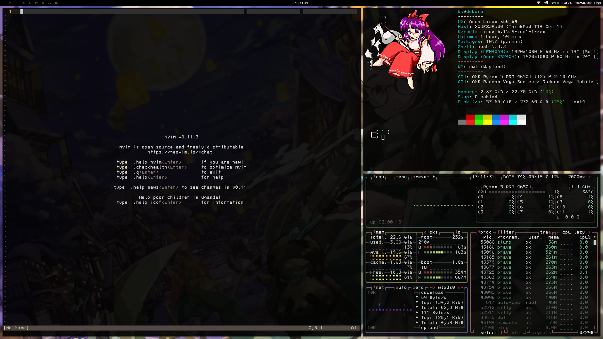

# dot\_dwl

Finaly I found a courage to properly patch dwl. Future adjustments are highly probable since now I am going to use it.

The deploy scipt can handle installation of this dotfiles. But bevare since it overwrites files with same names.

The behaviour of dwl is mostly the same as dwm, thus I am not going to explain it here.
